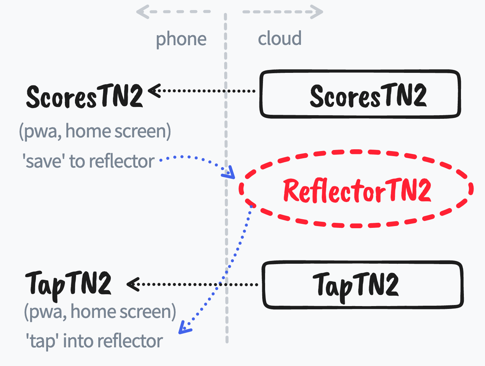

# scorebaord_reflector_tn2
Version: 2.2g
Simple Golang web site that caches or reflects score data from ScoresTN2 application

## SYSTEM OVERVIEW

This application is part of a system that expands the typical scoring keeping phone application.

With other scoring applications, two problems occur:
1. The score keeper may not always show the score to video or people
2. The display on the phone may not be large enough

To solve this, there are actually 3 applications in this system:

- ScoresTN2 - application used by score keeper
- TapTN2 - application used by parents and fans
- <u><b>ReflectorTN2</b></u> - backend server to share the scores

The [ScoresTN2](https://github.com/alpiepho/scoreboard_tn2) application is similar to other
applications you can install from the Apple App Store or Google Play...but you don't need to use
either to get it!  It is a newer form of web application, a PWA, that can be opened from
a website and 'saved' to your IPhone or Android home screen.

The [TapTN2](https://github.com/alpiepho/scoreboard_tap_tn2) application is similar in style to
ScoresTN2, but only "taps' into the ReflectorTN2 site to show the scores that were recently
sent by ScoresTN2.  Again, you install it by going to the site and use options described below
to save it to your home screen.

The [ReflectorTN2](https://github.com/alpiepho/scoreboard_reflector_tn2) application is the backend
server that shares the data between the first two applicaitons.  There is no user application, but
both ScoresTN2 and TapTN2 need to be configured to use the same link to ReflectorTN2.

ScoresTN2 and TapTN2 are PWAs, Progressive Web Applications, written in Flutter. ReflectorTN2 is
a Golang application hosted on Google Cloud.  It recieves scores from ScoresTN2 and allows TapTN2 to
get them.  NOTE: the data on ReflectorTN2 is automatically deleted 1 hour after if now new scores
are recieved from ScoresTN2 for each score keeper.

FOOTNOTE: if you are wondering about "TN", it stands for "That Name"...the first words the authors
father-in-law said when his daughter told him we were getting married.  "You are going to have 'that name'?"

## REALLY SIMPLE DESIGN

- Simple site that tracks the most recent scores
- Use GET with params as *input*, not real api
- Clears data at certain size
- Clears data after certain idle time
- Web endpoints:
    - "/" get raw text dump of all data
    - "/scorer" get raw text data for "scorer"
    - "/scorer/count" get count of packets for scorer, returns json
    - "/scorer/n" get nth packet, returns json
    - "/add?s=scorer&d={comma separated data}" how to add data with GET
    - "/reset" reset application
- data added with scorer id
- timestamp added to data packet as received

## IDEAS ON HOSTING AND CONTROLLING COST

- Build Go app within Docker
- no database
- data table in memory only
- look for hosting site that is
    - cheap
    - limits cost or resources
- Digital Ocean since already have account

## ADDRESSING SECURITY

- to keep it simple, limit host ability to scale
- limit amount of data held (flush after 15 minutes?)
- only handle GET
- use a non-standard port (via docker)
- security thru obscurity
- assume data is not really valueable, **BUT KEEP QUESTIONING THAT ASSUMPTION**

## TODO AND FUTURE CHANGES
- [x] readme with rough design goals
- [x] Use GET with params as *input*, not real api
- [x] Clears data at certain size
- [x] Clears all data after certain idle time
- [x] Clears data after certain idle time, by keeper
- Web endpoints:
- [x]     - "/add?s=scorer&d={comma separated data}" how to add data with GET
- [x]     - "/reset" reset all data
- [x]     - "/reset/(keeper)" reset data by keeper
- [x]     - "/" get html text dump of all data
- [x]     - "/raw" get raw text dump of all data
- [x]     - "/json" get json dump of all data
- [x]     - "/count" count of data, raw
- [x]     - "/(index)" get json dump of data by global index, json
- [x]     - "/(keeper)"
- [x]     - "/(keeper)/raw"
- [x]     - "/(keeper)/json"
- [x]     - "/(keeper)/count"
- [x]     - "/(keeper)/(index)"
- [x] data added with scorer id
- [x] timestamp added to data packet as received
- [x] start docker file
- [x] flush out json operations
- [x] ScoresTN2 - add settings for scorer, reflector
- [x] ScoresTN2 - integrate with reflector
- [x] ScoresTN2 - verify speed etc.
- [x] try hosting
- [x] start ScoresTapTN2
- [-] review use of gin?, seems to have pulled in many packages
- [x] refactor lists
- [x] delete based on cron, say daily...relative hours is too complicated
- [x] build admin page
- [x] add logs
- [x] hook logs
- [x] hook resets
- [x] log control (on, off)
- [x] all/merged (indent)
- [x] all/merged (color)
- [ ] admin insert comments and corrections
- [ ] stress tests, lots, roller, fast?
- [ ] for scores: add copy keeper

## HOW TO RUN LOCAL index.html (if needed)

- live server
    - npm install -g live-server
    - live-server
- python
    - TBD
- golang
    - TBD

## HOW TO RUN SERVER LOCALLY

- go run main.go

## HOW TO RUN (SERVER) WITH DOCKER LOCALLY

- docker build -t scorebaord_reflector_tn2 .
- docker run -it -p 3000:3000 scorebaord_reflector_tn2

## APPENDIX: original BACKGROUND

The ScoresTN2 is a PWA for scoring youth sports, like volleyball.  Typically, one person keeps score on a smart phone, flashing the on going score to a video recording, or to other spectators.

Two problems occur:
1. The score keeper may not always show the score
2. The display on the phone may not be large enough

As I was thinking about how to improve the ScoresTN2 application, I wanted to find a way to solve the problem of people shouting "Hey, what is the score...I still can't read it".

Several ideas of larger screens with BT and ardino, or even LED glasses and arduino rolled thru my head, or a service that texted scores etc.  All of these seem overkiil.  I finally settled on a hosted server.

But I wanted to keep it really simple.  I don't want the hastle or possible cost of a hacked or run away service.  I can tolerate someyhing small per month.  I have been using simple VPN that one of the Google/Alphabet companies created, "Outline VPN".  This shows you how to easily set up your own VPN and hosts on Digital Ocean for $5/month.  That is my goal for hosting this reflector.

I debated about a real web server with authentication or a websever with websockets.  First thought about using Dart (as shown in the Boaring show videos) or Golang with Websockets (a cominations used at my day job).  Several links are show in the REFERENCES section below.  One key take away is that I could create a server in any language and wrap it with a Docker container that should be easy to host.

I finally decided to try a very simple server without a real API.

## APPENDIX: EXAMPLE curl COMMANDS

- curl localhost:3000/hello  - send "hello" 
- curl localhost:3000/reset  - reset system    
- curl localhost:3000/       - return list of counts from hello requests    
- curl localhost:3000/add?data=test
- curl "localhost:3000/add?data=test data"  fails
- curl "localhost:3000/add?data=test%20data"  passes
- curl "localhost:3000/add?data=test,data"  passes

reverse lines
sed '1!G;h;$!d' /tmp/test

## APPENDIX: APP ENGINE NOTES

- gcloud auth list
- git clone https://github.com/alpiepho/scoreboard_reflector_tn2.git reflectortn2
- cd reflectortn2
- sudo apt-get install google-cloud-sdk-app-engine-go
- go build main.go
- go get github.com/gin-gonic/gin
- go get github.com/go-co-op/gocron
- gcloud app deploy
- gcloud app browse

Welcome to Cloud Shell! Type "help" to get started.
Your Cloud Platform project in this session is set to refelectortn2.
Use “gcloud config set project [PROJECT_ID]” to change to a different project.
alpiepho@cloudshell:~ (refelectortn2)$ history

## APPENDIX: RAW COMMANDS FROM GOOGLE CLOUD

- search Google Cloud
- login
- dash board for ReflectorTN2
- open console

<pre>
    1  gcloud auth list
    2  gcloud config list project
    3  gcloud config set project
    4  gcloud config set project ReflectorTN2
    5  gcloud config set project refelectortn2
    6  git clone https://github.com/alpiepho/scoreboard_reflector_tn2.git
    7  ls
    8  cd scoreboard_reflector_tn2/
    9  cd ..
   10  cd -
   11  ls
   12  sudo apt-get install google-cloud-sdk-app-engine-go
   13  gcloud app deploy
   14  ls
   15  git pull
   16  gcloud app deploy
   17  gcloud app browse
   18  gcloud app deploy
   19  ls
   20  cd scoreboard_reflector_tn2/
   21  go build main.go
   22  gcloud app deploy
   23  go --version
   24  go -version
   25  go -v
   26  go help
   27  vi go.mod
   28  go build main.go
   29  go get github.com/gin-goinc/gin
   30  go get github.com/gin-gonic/gin
   31  go build main.go
   32  go get github.com/go-co-op/gocron
   33  go build main.go
   34  git status
   35  git diff go.mod
   36  gcloud app deploy
   37  gcloud app browse
   38  history
</pre>

## REFERENCES

- https://tutorialedge.net/golang/go-websocket-tutorial/
- https://gowebexamples.com/websockets/
- https://yalantis.com/blog/how-to-build-websockets-in-go/
- https://dev.to/heroku/deploying-your-first-golang-webapp-11b3
- https://medium.com/google-cloud/building-a-go-web-app-from-scratch-to-deploying-on-google-cloud-part-1-building-a-simple-go-aee452a2e654
- Google Flutter Boaring Show parts 1 and 2:
- https://www.youtube.com/watch?v=AaQzV1LTmo0&t=1s
- https://www.youtube.com/watch?v=K85PUBjFhn8&t=1s
- https://getoutline.org/
- Websockets in 100s
- https://www.youtube.com/watch?v=1BfCnjr_Vjg

- https://deepsource.io/blog/go-web-frameworks/
- https://github.com/gin-gonic/gin
- https://github.com/go-co-op/gocron

The "scoreboard_" family of projects:
- https://github.com/alpiepho/scoreboard_tn2
- https://github.com/alpiepho/scoreboard_reflector_tn2
- https://github.com/alpiepho/scoreboard_tap_tn2

- https://ramezanpour.net/post/2020/08/23/cors-support-go-gin

